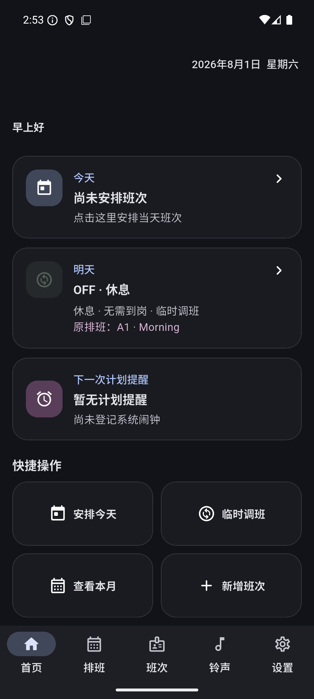
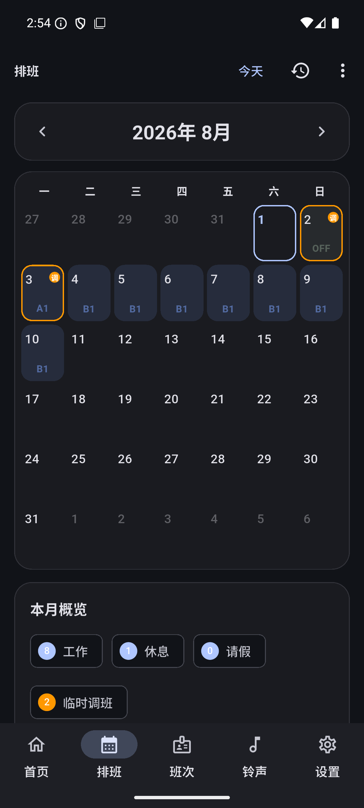
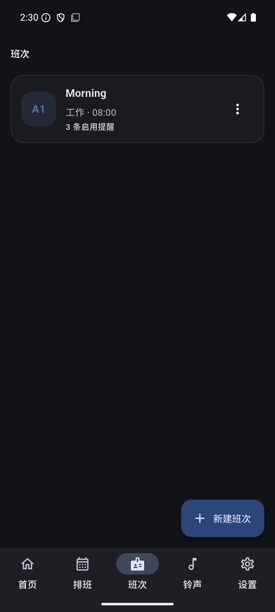
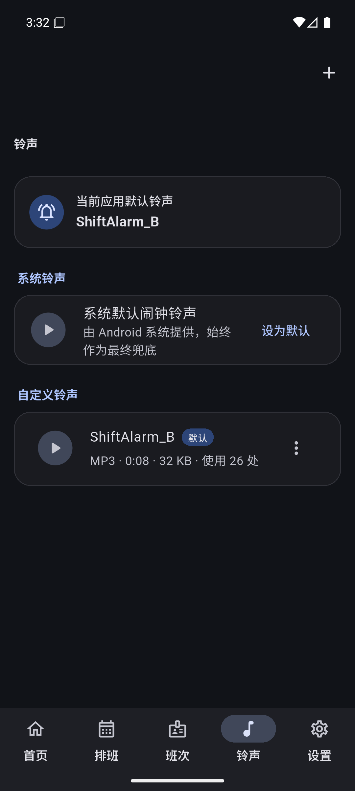
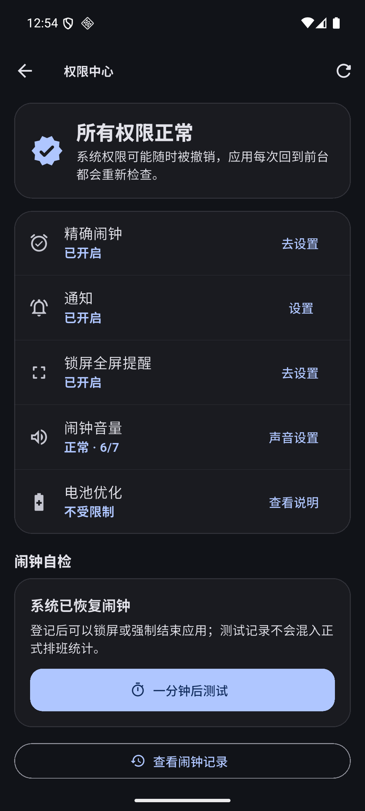
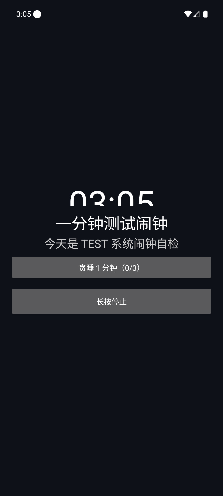
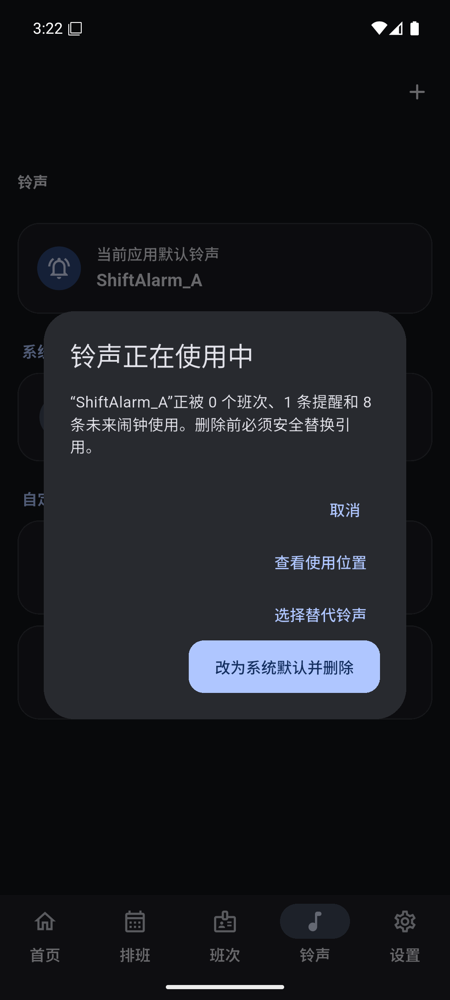
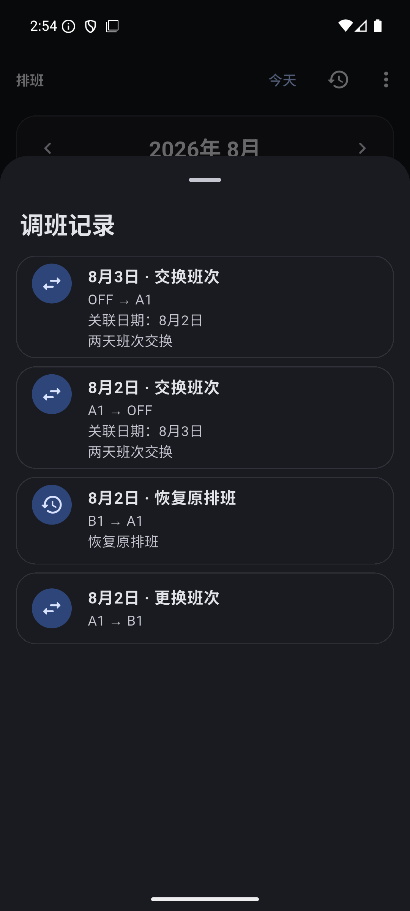

# ShiftAlarm

ShiftAlarm（排班闹钟）是一款面向轮班、倒班和不固定作息用户的 Android 本地排班与精确闹钟应用。它把班次模板、月历排班、临时调班、提醒规则和自定义铃声组合成一条可恢复的原生系统闹钟链路。

> [!WARNING]
> `v1.0.0-beta.1` 是已发布的内部测试版本；`1.0.0+5` 是正在验收的 Beta002 候选构建。当前 Release APK 使用 **Debug certificate** 签名，仅供兼容性测试，不适合应用商店上架或长期公开分发。若覆盖安装提示签名不一致，请先备份数据，不要直接卸载旧版本。

## 当前版本

- 已发布 Beta：`v1.0.0-beta.1`
- 当前候选构建：`1.0.0+5`（Beta002，尚未打标签）
- 包名：`com.shiftalarm.app`
- Android：minSdk 24，targetSdk 36
- SQLite：Schema v4，采用增量迁移保留旧数据
- 下载：[GitHub Pre-release](https://github.com/Garyff1/ShiftAlarm/releases/tag/v1.0.0-beta.1)（私有仓库，需要登录获授权的 GitHub 账户）

## 核心能力

- 五页主导航：首页、排班、班次、铃声、设置
- 标准、大字、简易三种界面模式；首次选择后可在设置中随时切换
- 简易模式三页导航、今日/明日大卡片、下一闹钟倒计时和七天排班
- 调班前后及闹钟数量预览、通俗化状态反馈与权限说明
- 高对比度、减少动态效果、触觉反馈和 TalkBack 基础语义
- 班次模板、三条默认提醒、跨日到岗和相对/固定时间提醒
- 42 格月历、单日排班、批量排班、休息/请假与备注
- 临时调班、恢复原排班、两日交换、复制和完整变更记录
- Android 精确闹钟、稳定 PendingIntent ID、锁屏全屏提醒和前台响铃服务
- 停止、贪睡次数限制、15 分钟超时、振动和 30 秒音量渐强
- 重启、时间、日期、时区及权限变化后的闹钟恢复
- Direct Boot：用户尚未解锁时从设备保护快照恢复近期闹钟
- MP3/WAV/M4A/AAC/OGG 导入、SHA-256 校验、试听、重命名和引用保护删除
- 铃声优先级：单条提醒 → 班次 → 应用默认 → Android 系统默认

## 关键权限

ShiftAlarm 会根据 Android 版本使用以下权限：

- 精确闹钟：按计划时间登记 `AlarmManager` 闹钟
- 通知：显示响铃前台服务、停止和贪睡操作
- 全屏提醒：在允许时显示锁屏响铃界面
- 前台媒体播放服务：保证正式响铃由原生前台服务承担
- 开机完成：恢复重启前登记的未来闹钟
- Wake Lock 与振动：在响铃期间短暂保持执行并提供振动

应用内“权限中心”会显示精确闹钟、通知、全屏提醒、闹钟音量和电池优化状态。不同厂商仍可能要求额外允许自启动或后台运行。

## 截图

| 首页 | 排班日历 | 班次 |
| --- | --- | --- |
|  |  |  |

| 铃声库 | 权限中心 | 锁屏响铃 |
| --- | --- | --- |
|  |  |  |

| Direct Boot | 自定义铃声保护 | 调班记录 |
| --- | --- | --- |
|  |  |  |

| Beta002 首次选择 | 简易首页 | 调班预览 | 大字/最大字体 |
| --- | --- | --- | --- |
|  |  |  |  |

截图仅包含模拟器测试数据，不包含真实班表、私人音频、账号、文件路径或锁屏凭据。

## 开发环境

- Flutter 3.41.8 stable
- Dart 3.11.5
- JDK 21
- Android Gradle Plugin/Gradle Wrapper：以仓库配置为准
- Android SDK：compile/target SDK 36

## 本地构建

```text
flutter pub get
flutter analyze
flutter test --reporter expanded

# Android Kotlin/JUnit
cd android
./gradlew :app:testDebugUnitTest
cd ..

flutter build apk --debug
flutter build apk --release
```

Windows 工作区包含非 ASCII 字符时，Flutter AOT 工具链可能出现路径编码问题；可在不改变源码的前提下，从等价 ASCII 临时目录执行 Release 构建。

## 验证状态

- Flutter/Dart/Widget：230/230 passed
- Kotlin/JUnit：23/23 passed
- 自动化总计：253/253 passed
- `flutter analyze`：No issues found
- API 36：Beta001 的七条原生闹钟/铃声流程已通过；Beta002 的首次选择、简易排班、模式持久化、最大字体和模式切换数据回归已通过
- Beta002 模式切换后，测试排班对应的 3 条未来系统闹钟仍与 3 个唯一原生 ID 一一对应

CI 在 `main` push、PR 和手动触发时运行静态分析、Flutter 测试、Kotlin 测试和 Debug APK 编译验证。CI 产物不是本地验收过的 Beta Release APK，也不会自动发布。

## 文档

- [变更记录](CHANGELOG.md)
- [隐私与本地数据说明](PRIVACY.md)
- [测试说明](TESTING.md)
- [已知问题](KNOWN_ISSUES.md)
- [兼容性测试矩阵](docs/compatibility-test-matrix.md)
- [第三阶段验收报告](docs/STAGE3_ACCEPTANCE_REPORT.md)
- [第四阶段验收报告](docs/STAGE4_ACCEPTANCE_REPORT.md)
- [Beta002 开发验收报告](docs/BETA002_ACCEPTANCE_REPORT.md)

## 隐私摘要

当前 Android Manifest 不声明 `INTERNET` 权限，源码也未引入网络客户端或遥测/崩溃上报 SDK。班次、排班、设置、闹钟记录和导入音频保存在应用本地私有存储；系统文件选择器提供的音频会复制进应用内部目录。完整说明见 [PRIVACY.md](PRIVACY.md)。

## 已知边界

- Beta APK 仍使用 Debug certificate 签名
- 尚未完成 API 24–35 和主要厂商真机矩阵
- Beta002 尚待真机完成 TalkBack 手势、权限关闭/恢复、锁屏自定义铃声和贪睡整套发布验收
- Android `force-stop` 会由系统撤销闹钟，不能等同于普通进程死亡
- 尚无完整备份/恢复和脱敏诊断导出
- 厂商省电、自启动和全屏策略可能影响后台可靠性

请通过仓库的 Bug Report 模板反馈问题，并且不要上传私人音频、完整班表、个人数据库、锁屏凭据或签名材料。
