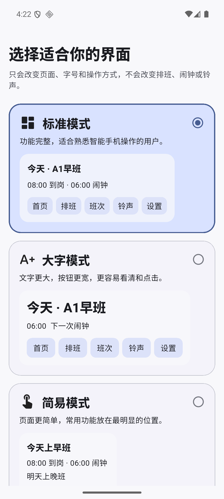
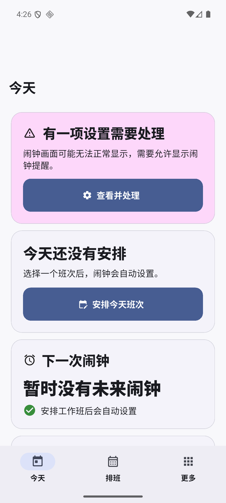
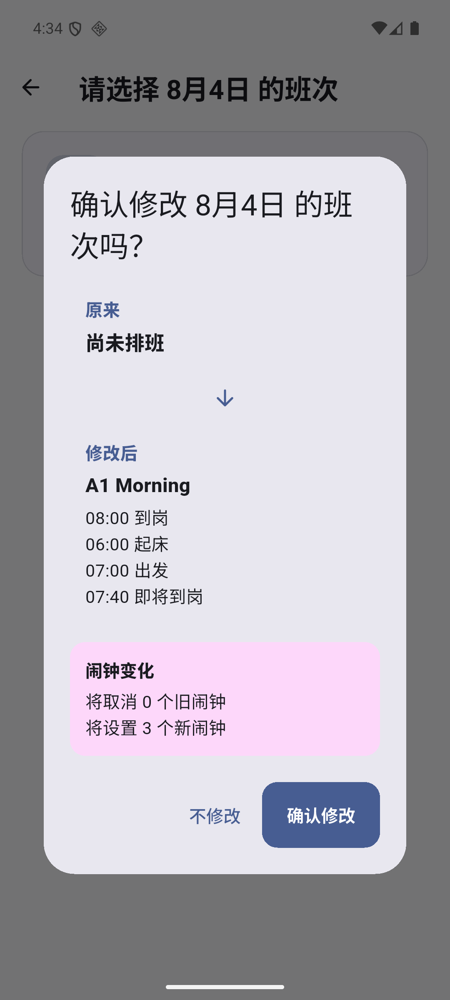
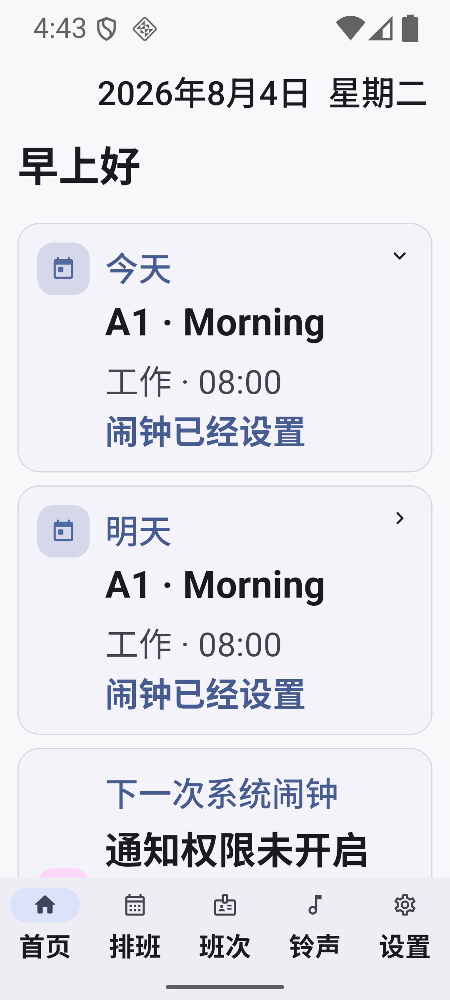

# ShiftAlarm V1.0 Beta002 开发验收报告

验收日期：2026-08-04
候选版本：`1.0.0+5`
当前结论：**开发与 API 36 模拟器验收通过；发布标签暂缓**

Beta002 的三种界面模式、简易排班、调班前后预览、大字/最大字体、高对比度、减少动态效果、触觉反馈和基础 TalkBack 语义已经落盘。自动化、Debug/Release 构建及 API 36 模拟器数据回归通过。由于当前没有连接真实手机，TalkBack 手势、权限关闭/恢复、锁屏自定义铃声、贪睡和资源释放仍需真机完成，因此不提前创建 `v1.0.0-beta.2` 标签。

## Codex 完成后汇报（28 项）

1. **项目路径**
   `C:\Users\hehe\Documents\简历代投\outputs\shift_alarm`

2. **分支名称**
   `feature/beta002-accessibility-ui`，基于 `main` 的 `49f934a93376c8c18aea5db6c8721bf00d75e5d0` 开发。

3. **应用版本**
   Flutter 版本 `1.0.0+5`，Android `versionName=1.0.0`、`versionCode=5`，包名 `com.shiftalarm.app`，`minSdk=24`、`targetSdk=36`。SQLite Schema 仍为 v4，本阶段没有业务表结构变更。

4. **新增设置字段**
   `interfaceMode`、`reduceMotion`、`highContrastEnabled`、`readAloudEnabled`、`hapticFeedbackEnabled`。未知模式回退标准模式；旧版本设置不存在模式字段时保持标准模式且不强制重新引导。

5. **三种模式实现结构**
   `AppInterfaceMode` 提供稳定存储值和中文名称；`AppModeTheme` 集中管理字号、间距、触控高度、导航高度和动画时长；`ShiftAlarmApp` 根据设置实时重建主题；标准/大字共享五页业务 UI，简易模式使用独立三页外壳，但全部复用原有 Provider、Controller、Repository、数据库和闹钟同步链路。

6. **简易模式页面列表**
   简易首页、七天排班、可见式班次选择、更多、通俗化权限中心，以及从“更多”进入的班次、铃声、设置、关于和整月排班页面。

7. **大字模式字号体系**
   由主题统一按 `1.30` 比例放大 Material 3 文本体系，不在各业务页散落一套字号；普通触控目标最小 56dp、主要按钮 60dp、底部导航 88dp，并增加页面、卡片和分区间距。

8. **最大字体适配**
   Android API 36 模拟器把 `font_scale` 调至 `2.0`，浏览首页、排班、班次、铃声、设置五页，未发现按钮遮挡、FATAL、ANR 或 RenderFlex overflow；调班弹窗和模式选择采用滚动容器。响铃页的最大字体仍需真机到时状态复核。

9. **高对比度实现**
   设置页可即时开关高对比度；主题提高主次文字、边框和深色模式表面对比。成功、异常、休息和临时调班均由图标/边框与文字共同表达，不只依赖颜色。

10. **减少动态效果实现**
    设置页可即时开关；开启后页面过渡时长归零，模式主题对非必要动画提供零时长。必要加载和结果状态仍保留。

11. **TalkBack 语义覆盖**
    首页班次与下一闹钟、简易班次卡、七天日期卡、日历日期、调班预览、班次卡和主要图标按钮已增加中文 `Semantics` 或 tooltip。Widget 测试覆盖核心语义；真实 TalkBack 焦点顺序与手势仍待手机检查。

12. **调班预览和反馈**
    标准和简易流程复用统一确认弹窗，显示原来/修改后班次、到岗和提醒时间，以及取消旧闹钟/设置新闹钟数量。保存后以实际 `alarmSyncStatus` 区分“新闹钟已经设置”和“班次已改但闹钟设置失败”，失败时提供“立即处理”。

13. **撤销功能是否完成**
    未完成。撤销属于 P1，涉及排班、原生闹钟与变更日志的原子恢复，本候选构建没有加入半成品入口。

14. **页面朗读是否完成**
    设置模型保留 `readAloudEnabled`，页面朗读未接入系统 TTS。该项属于 P1，避免与正式闹钟 Audio Focus 互相影响前需要单独设计和真机验证。

15. **自动化测试总数**
    共 **253 项**：Flutter/Dart/Widget 230 项 + Kotlin/JUnit 23 项，高于任务单建议的至少 220 项。

16. **Flutter 测试结果**
    从 `flutter clean` 后执行 `flutter test --reporter expanded`，**230/230 passed**。新增覆盖设置序列化/旧数据迁移、友好状态、主题尺度、首次选择、三模式导航、简易排班、调班预览、最大字体和语义。

17. **Kotlin 测试结果**
    **23/23 passed**：AlarmAudioPlayer 4、AlarmPayload 6、AlarmRules 9、DirectBootSoundStore 4。Windows Unicode 路径会导致 Gradle 测试 worker 类加载异常，因此在等价 ASCII 临时目录运行；测试后临时目录已删除。

18. **`flutter analyze` 结果**
    `No issues found`。

19. **Debug 和 Release APK**
    Debug：`build/app/outputs/flutter-apk/app-debug.apk`，153,482,824 bytes，SHA-256 `543E2730A1AC3F33A5DF27900F51898E01FA60ABC90F46B1EAFAA9ECBFE449A1`。
    Release：`build/app/outputs/flutter-apk/app-release.apk`，59,380,152 bytes，SHA-256 `E6D8CB78BA730036ECAE2B8DD18EEF3C6894A1411642B5E0342855C523C55E8E`。
    两者均通过 Android 签名校验；当前 Release 仍使用 Debug certificate，仅限 Beta 测试。

20. **API 24–36 验证情况**
    `minSdk=24` 且 compile/target SDK 36，静态编译和自动化测试覆盖版本分支；运行时仅在 API 36 模拟器执行。API 24、28、31、33、34、35 以及主要厂商真机仍待兼容性矩阵验证。

21. **八组人工验收结果**
    流程一首次选择通过；流程二模式切换的数据与闹钟部分通过，自定义铃声保持由既有第四阶段链路与共享数据层覆盖，仍待本候选真机复核；流程三最大字体五主页面通过，新建/修改/临时调班的最大字体组合待真机补测；流程四简易七天排班和前后预览通过；流程五已验证通俗警告和处理入口，权限关闭/恢复待真机；流程六完成语义代码与 Widget 检查，真实 TalkBack 待真机；流程七设置和零时长主题实现通过，视觉手感待真机；流程八既有原生链路已在第三、第四阶段通过，本候选仍需手机完成锁屏响铃/贪睡/释放。

22. **原闹钟和铃声回归结果**
    模式切换只保存设置，不重建数据库、不复制铃声、不启动音频服务。API 36 在简易→大字→标准并多次强制结束/重启应用后，今日和明日 A1 排班保持；既有原生闹钟、Direct Boot 和自定义铃声自动化测试全部继续通过。

23. **`dumpsys alarm` 结果**
    候选场景存在 3 条有效 `RTC_WAKEUP`：`com.shiftalarm.app.ALARM.10000`、`10001`、`10002`，对应 06:00、07:00、07:40；切换模式后数量和 ID 不变，未出现当前排班重复闹钟。

24. **截图**
    `docs/screenshots/beta002/01-onboarding.png`：三模式首次选择。
    `docs/screenshots/beta002/02-simple-home.png`：简易首页与通俗权限提醒。
    `docs/screenshots/beta002/03-shift-preview.png`：班次及新旧闹钟预览。
    `docs/screenshots/beta002/04-large-max-font.png`：大字模式叠加系统最大字体。

25. **已知问题**
    Release 仍使用 Debug certificate；Windows Flutter AOT/Gradle worker 对中文项目路径有编码问题；真实 TalkBack、权限恢复、锁屏和厂商后台策略尚未完成；简易模式新建班次仍复用完整编辑页，没有实现 P1 风格的四步向导。

26. **与任务单差异**
    P0 的实现、自动化和构建已完成；发布级真机 P0 回归尚未完成，因此报告不宣称 Beta002 正式发布通过。P1 已完成倒计时、触觉反馈、通俗权限和高对比度；未完成撤销、页面朗读、月份切换动画及完整动效增强。

27. **Pull Request 地址**
    Draft PR：<https://github.com/Garyff1/ShiftAlarm/pull/1>，标题为 `Beta002: add large text, simple mode and accessibility improvements`。在 PR CI 与真机发布验收通过前不合并、不打 `v1.0.0-beta.2` 标签。

28. **下一阶段建议**
    先在用户手机完成报告中标记为待测的四条发布验收并记录厂商/系统权限状态；再完成 API 24–35 代表版本矩阵和正式 Release keystore。Beta002 发布后，根据真机反馈选择 Beta003 备份/诊断/兼容性修复，或 V1.1 Excel/CSV 导入与核实流程。

## 本轮截图

| 首次选择 | 简易首页 |
| --- | --- |
|  |  |

| 调班预览 | 大字与最大字体 |
| --- | --- |
|  |  |
