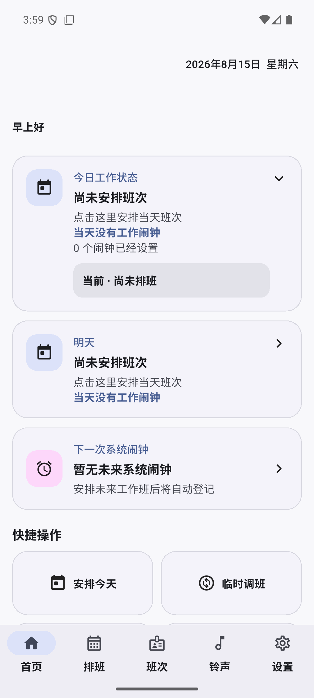
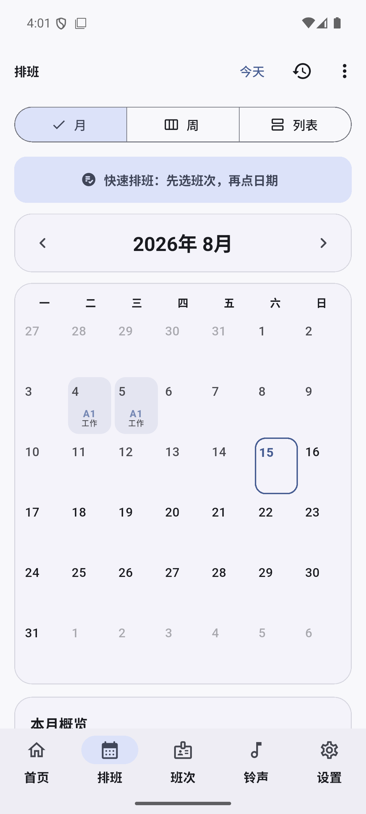
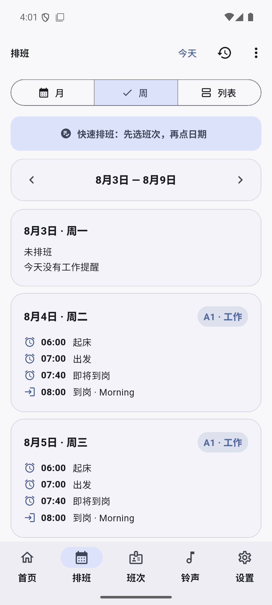
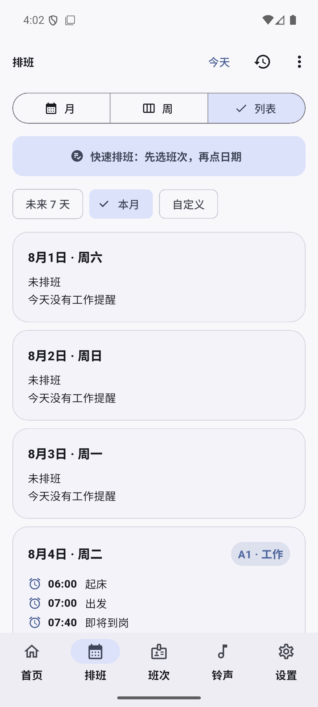
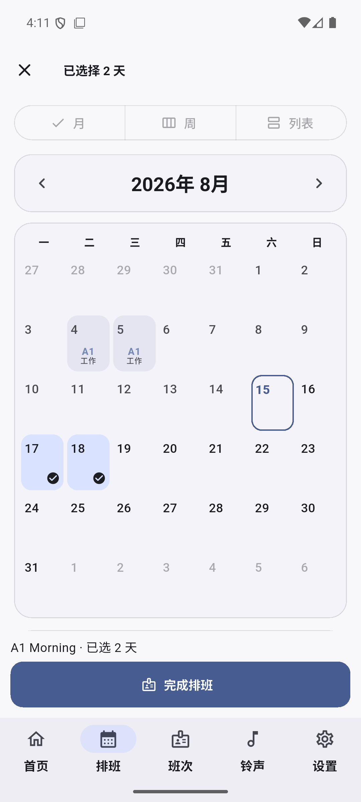
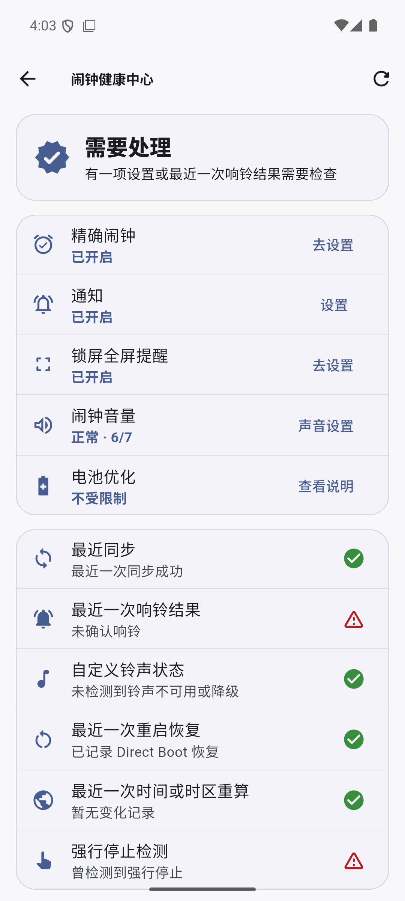
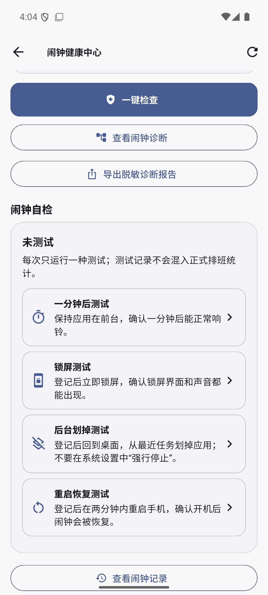
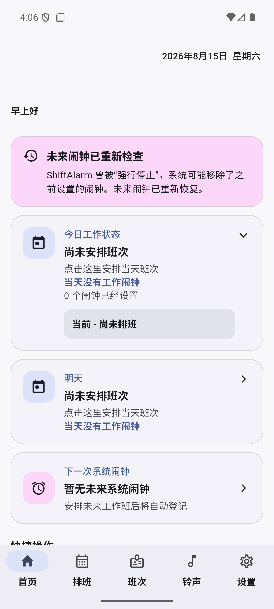
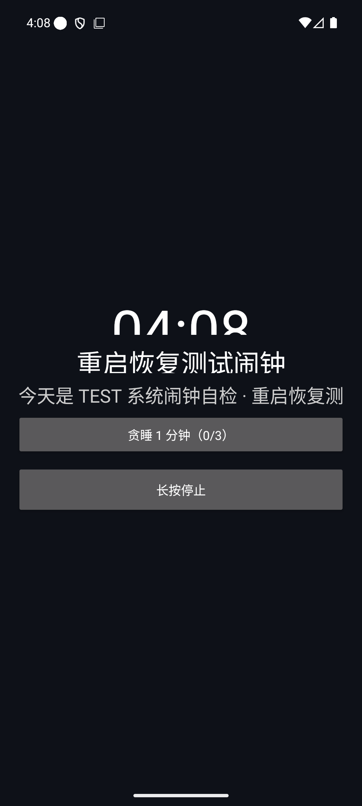

# ShiftAlarm V1.0 Beta003 Android 开发验收报告

- 验收日期：2026-08-16
- 候选版本：`1.0.0+6`
- 分支：`feature/beta003-alarm-reliability-schedule-ui`
- 当前结论：**开发、自动化与 API 36 模拟器验收通过；物理真机发布验收和 Beta003 标签暂缓**

Beta003 已完成 Android Alarm Lifecycle、Force Stop 恢复、闹钟诊断与脱敏导出，以及月/周/列表排班重构。最终 Release 候选包已在 API 36 模拟器完成 Force Stop 三步验证，并让恢复后的同一只闹钟在锁屏下真实进入 `AlarmRingingActivity` 与前台 `AlarmRingingService`。当前没有连接物理手机，因此本报告不把多厂商真机兼容性提前写成通过，也不创建 `v1.0.0-beta.3` 标签。

## 1. 漏响根因与修复

偶发漏响已经稳定复现。Android 对应用执行 Force Stop 后会取消该应用的 `PendingIntent` 闹钟，但 ShiftAlarm 本地 `alarm_records` 仍保留 `registered`。旧同步器看到稳定键、触发时间和 `registered` 状态均未变化，会命中“无需重新登记”的快速路径，导致用户重新打开应用后仍没有把系统闹钟补回去。

修复包括：

- API 35+ 读取历史启动原因和 `wasForceStopped`，明确记录 Force Stop；
- Force Stop 后首次启动绕过未变化快速路径，强制用稳定 PendingIntent ID 重新登记；
- API 24–34 无可靠 Force Stop 启动信号，因此每次冷启动执行一次稳定 ID 幂等重登记；
- 首页展示“已恢复闹钟”，健康中心保留 Force Stop 状态与说明；
- 普通划掉最近任务与 Force Stop 分开表述，避免误导用户。

系统处于 Force Stop 的 stopped state 时应用不能自行运行或立即恢复；必须由用户重新打开应用，之后 ShiftAlarm 才能补回未来闹钟。

## 2. Alarm Lifecycle 架构

新增独立 `alarm_lifecycle_events` 表，SQLite Schema 从 v4 增量升级到 v5。事件按闹钟 ID、稳定原生 ID、计划触发时间、实际发生时间、阶段、失败分类和脱敏详情保存；保留 30 天且最多 1000 条。

正常链路可记录：计划生成、系统登记、Receiver 接收、服务启动、音频准备、音频开始、停止、贪睡和 15 分钟超时。异常链路可区分：系统未触发、服务未启动、音频未开始、自定义铃声不可用、播放/服务失败、权限阻断、Force Stop、Direct Boot 恢复和时间/时区重算。

原生 Receiver、Service 与 AudioPlayer 先写设备保护存储，Flutter 启动时再消费并合并进 SQLite，因此进程结束、锁屏或 Direct Boot 场景不会依赖 Dart isolate 正在运行。

## 3. Force Stop、诊断中心与导出

“闹钟健康中心”现在集中显示：

- 精确闹钟、通知、全屏提醒、闹钟音量和电池优化；
- 最近同步与最近响铃结果；
- 自定义铃声不可用/降级状态；
- Direct Boot 恢复、时间/时区重算和 Force Stop 检测；
- 普通、锁屏、后台划掉、重启恢复四种互斥自检入口；
- 单只闹钟的 lifecycle 诊断和脱敏报告导出。

诊断报告同时生成 JSON 和 TXT，并由 Android Sharesheet 分享。报告哈希化业务 ID，只允许输出预定义状态字段；不会包含用户名、公司、完整班表、音频内容、真实文件路径、数据库、账号令牌或签名材料。

## 4. 排班 UI 重构

- 月视图：保留 42 格日历，在日期格显示班次代码、类型和临时调班标记。
- 周视图：七天纵向时间线展示各提醒、到岗时间、班次类型；未排班时明确写“今天没有工作提醒”。
- 列表视图：支持未来 7 天、本月和自定义日期范围。
- 最后使用的月/周/列表视图会持久化到设置。
- 快速排班先选班次，再连续点选日期；第二次点击同一日期会取消；底部显示班次和已选天数。
- 首页“今日工作状态”显示当前节点、下一节点、倒计时与“n 个闹钟已经设置”。

## 5. 调班预览与撤销

保存前继续显示原班次、目标班次、提醒时间与将取消/新增的闹钟数量。保存后 SnackBar 保留 7 秒撤销入口，撤销会使用保存前快照恢复当天排班并重新走闹钟同步，而不是只修改界面状态。同步部分失败时提供闹钟健康中心入口。

## 6. 自动化与构建

- `flutter analyze`：`No issues found`。
- Flutter/Dart/Widget：**242/242 passed**。
- Kotlin/JUnit：**23/23 passed**。
- 自动化总计：**265/265 passed**。
- Release APK：版本名 `1.0.0`、版本号 `6`、minSdk 24、target/compile SDK 36。
- APK 内已核对 `AssetManifest.bin`、`FontManifest.json`、`NativeAssetsManifest.json` 和完整 Material Icons 字体。
- APK Signature Scheme v2 校验通过；仍为 Android Debug certificate，仅限 Beta 测试。

Windows Flutter AOT 对中文项目路径存在编码问题。最终包从当前源码的纯英文临时构建副本执行官方 `flutter build apk --release --no-tree-shake-icons`，再安装回 API 36 模拟器检查；没有修改业务源码或手工拼装 APK。

## 7. API 36 `dumpsys` 与锁屏结果

最终 Release 候选包的 Force Stop 三步证据：

1. 登记重启恢复测试后，`dumpsys alarm` 出现活动 `RTC_WAKEUP`，tag 为 `com.shiftalarm.app.ALARM.9001`，`origWhen=2026-08-15 16:06:59.881`，exact、setAlarmClock 均生效。
2. 执行 Force Stop 后活动 ShiftAlarm 闹钟数变为 0，系统历史记录原因是 `pi_cancelled`。
3. 重开应用 7 秒内，同一 `ALARM.9001` 和同一 `origWhen` 重新出现；首页显示“已恢复闹钟 / 未来闹钟已重新检查”。

随后锁屏等待该恢复闹钟触发：

- `AlarmRingingActivity` 成为 top resumed/current focus；
- `AlarmRingingService` 为 `isForeground=true`，`foregroundId=31030`，通知类别为 alarm，包含停止/贪睡两个操作；
- 响铃页显示“重启恢复测试闹钟”、1 分钟贪睡和长按停止；
- 长按停止后 `AlarmRingingService` 消失，主页面恢复，未留下前台服务。

## 8. 物理真机结果

上一阶段已在用户手机验证应用进程结束和锁屏响铃、贪睡次数、停止及资源释放。本次 Beta003 新增的 Force Stop 识别/重开恢复、四种自检、诊断导出和三种排班视图尚未在连接的物理设备上执行；当前 `adb devices` 只有 API 36 模拟器。

因此当前结论是“Beta003 Android 候选实现通过”，不是“Beta003 多品牌正式发布通过”。下一步需至少在用户主力手机完成：普通测试、锁屏测试、后台划掉、重启未解锁、Force Stop 后重开、自定义铃声故障兜底和诊断导出。

## 9. APK

- 本地路径：`artifacts/beta003/ShiftAlarm-v1.0.0-beta003.apk`
- 标准构建路径：`build/app/outputs/flutter-apk/app-release.apk`
- 大小：55,337,408 bytes
- SHA-256：`7A6F01E33E738A9D3E501DACF06D86C3A08E4DDCC0428038DEDA91CE3EA0C014`

APK 由 `.gitignore` 排除，不提交进 Git 历史。Beta003 标签与 GitHub Release 等待真机发布验收后再创建。

## 10. GitHub PR

Draft PR：<https://github.com/Garyff1/ShiftAlarm/pull/2>。目标分支为 `feature/beta002-accessibility-ui`；PR 在真机发布验收前保持 Draft，不合并、不打 Beta003 标签。

## 11. 已知问题

- 当前 Release 仍使用 Debug certificate，不适合商店或长期公开分发。
- API 24–35 代表版本与小米、OPPO/vivo、华为/荣耀、三星等厂商策略仍待矩阵验证。
- API 24–34 无系统级 Force Stop 启动原因接口，采用冷启动稳定 ID 幂等重登记；能恢复但不会显示 API 35+ 同等级别的确证原因。
- 用户不重新打开处于 Force Stop 状态的应用时，Android 不允许应用自行恢复闹钟。
- 真实自定义铃声损坏、权限关闭/恢复、重启未解锁和后台划掉仍需在 Beta003 物理真机重新跑完。
- iOS AlarmKit、PlatformAlarmService 抽象和 iPhone 验收不在本阶段 Step 1–6 范围内。

## 12. 截图

| 首页与闹钟数量 | 月视图 | 周时间线 |
| --- | --- | --- |
|  |  |  |

| 列表视图 | 快速排班 | 闹钟健康中心 |
| --- | --- | --- |
|  |  |  |

| 四种测试模式 | Force Stop 恢复 | 锁屏响铃 |
| --- | --- | --- |
|  |  |  |

截图只含 API 36 模拟器测试数据，不含真实班表、私人音频、账号、文件路径或锁屏凭据。
